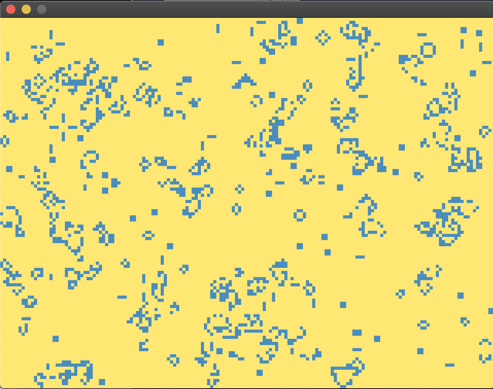

## Golang implementation of Game of Life 

- Inspired from the generic Leetcode solution 

Screenshot of the GUI output -> Uses Ebiten to power the GUI; runs till the end of further life generation. 

